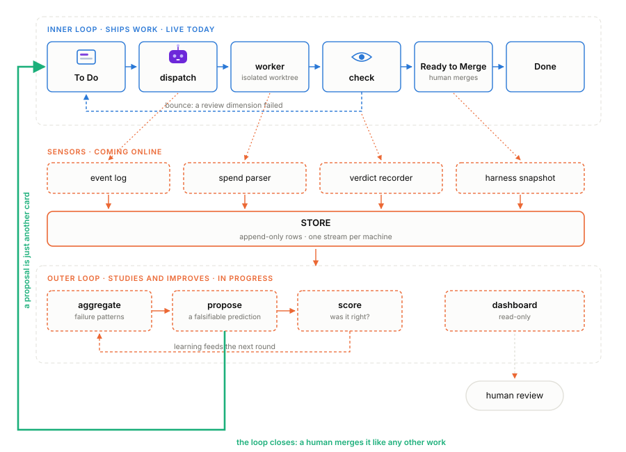
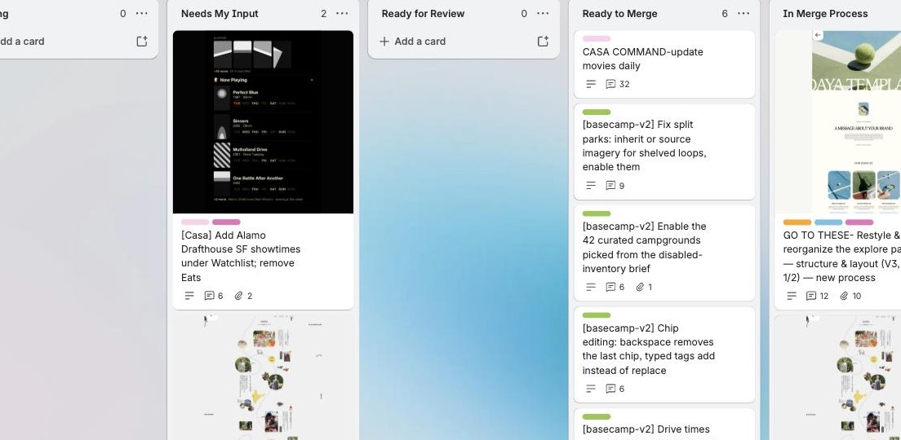
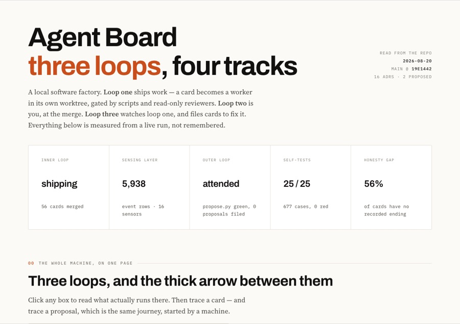
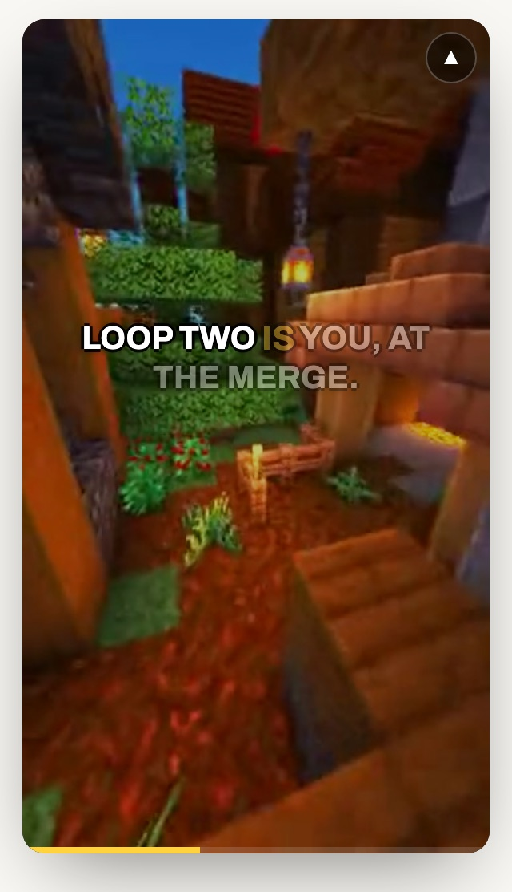
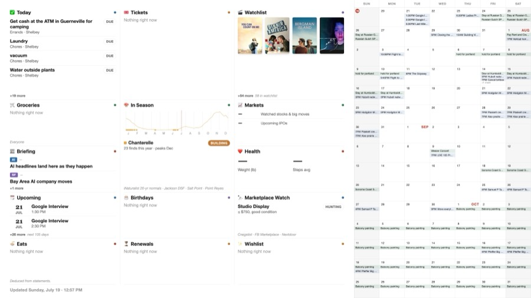
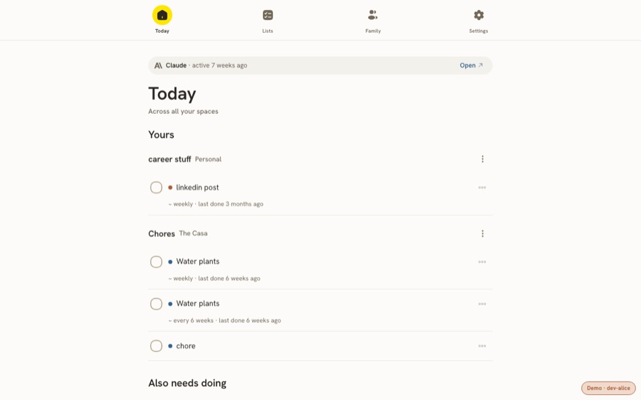
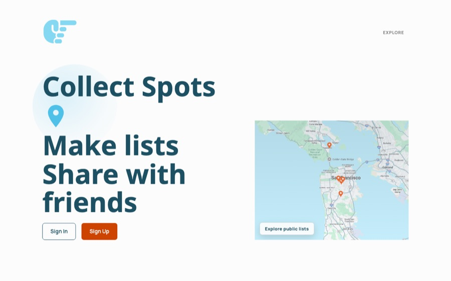
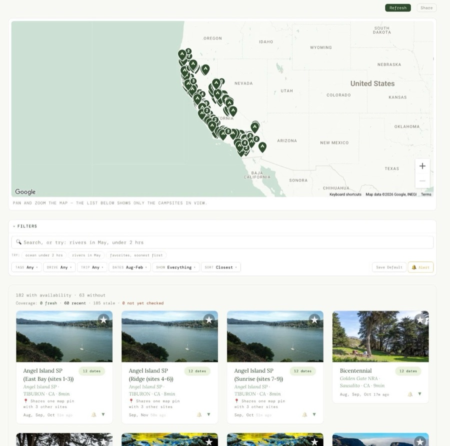

 
Software Engineer with a nontraditional path — opera 🎤 → [shrimp content](https://www.tiktok.com/@yoshelb?is_from_webapp=1&sender_device=pc) 🦐 → full-stack 💻. I build thoughtful, well-designed web experiences. Lately: deep in AI-assisted workflows.
 
[Portfolio](https://shelbeycasalena.com/) &nbsp;·&nbsp; [LinkedIn](https://www.linkedin.com/in/shelbey-casalena)
 
---
 
### What I'm building right now

**Agent Board**: my personal AI dev team, run from a Trello board. Trello instead of a homegrown board because it's free, has great apps, and is an API-ready source of truth, so there's nothing for me to build or host. Drop a card in To Do and a dispatcher spawns a Claude worker in an isolated git worktree; five reviewers judge the diff (one of them judges the rendered pixels), then an interactive merge loop boots each finished change in the browser so merging is a quick look and a yes. The whole thing is tuned to squeeze the most out of my Claude Max plan, with zero hosting costs. I'm now building the outer loop: sensors record the harness's own health, and a proposer reads that telemetry and files improvement cards back onto the board, working toward a system that improves and heals itself.
 Python (stdlib only) · Claude Code · Trello API · git worktrees

  
   the board (Agent Command Center) after an overnight run: the queue is cleared, six cards sit in Ready to Merge, two wait on human input

<table>
<tr>
<td width="46%">

</td>
<td>

**Explainers**

The factory ships faster than I can read every diff, so I've been thinking hard about how to keep myself genuinely in the loop. Explainers is one answer: a Claude Code skill that turns any of my projects into an interactive explainer page, with researched visual sections, audio briefings with word-synced captions over a looping brainrot video (inspo: pdf to brainrot), and a quiz to prove I actually absorbed it.

Claude Code skill · Gemini TTS · faster-whisper · canvas

</td>
</tr>
<tr>
<td width="46%">

</td>
<td>

**Casa Command Center**

Turns a Samsung Frame TV into the household's ambient dashboard: calendar, chores, film watchlist, markets, even mushroom season. Rendered at 4K with headless Chromium, pushed to the TV in Art Mode, and editable by the house AI assistant over MCP.

Python · Postgres · MCP · headless Chromium

</td>
</tr>
<tr>
<td width="46%">

</td>
<td>

**[Family Tasks](https://family-tasks-production-9def.up.railway.app/)**  (working name, still waiting on a real one)

A family task app where every member can connect their own AI assistant to the same shared lists via MCP. The moat is completion history: "when did I last mow the lawn?" is a first-class query.

FastAPI · MCP · SvelteKit · Supabase

</td>
</tr>
<tr>
<td width="46%">

</td>
<td>

**[GoToThese](https://www.gotothese.com/)** 

Collect and privately review places, make lists, and share them with friends and family.

Django REST · React · Google Places API · AWS S3

</td>
</tr>
<tr>
<td width="46%">

</td>
<td>

**[CampIntent](https://www.campintent.com/)** 

Campsite availability finder for California: search 100+ campgrounds across recreation.gov and Reserve California, and get alerts when a weekend opens up.

FastAPI · React · Postgres · Railway

</td>
</tr>
</table>

### Tech I reach for
 

